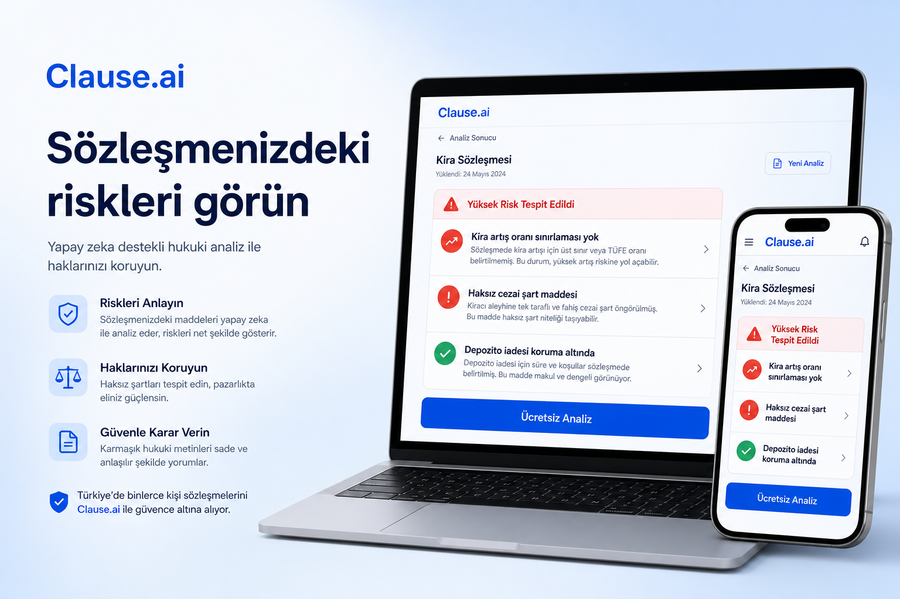

# Clause

**Türkiye için yapay zeka hukuk asistanı** — kira, iş ve tüketici sözleşmelerindeki riskleri sade dilde görün.

[tryclause.tech](https://tryclause.tech)

  

---

## Nedir?

Clause; uzun ve teknik sözleşmeleri **anlaşılır bir risk özetine** çevirir. Avukatın yerine geçmez — imzalamadan önce veya bir uyuşmazlık başladığında **neye dikkat etmeniz gerektiğini** hızlıca gösterir.

Çoğu insan “TBK madde …” diye aramaz.  
Şunu arar: *“Ev sahibi yüzde yüz zam istedi”*, *“Depozitomu vermiyor”*, *“İşten çıktım, kıdemim var mı?”*

Clause tam bu sorulara cevap vermek için tasarlandı.

---

## Kimin için?

| Siz… | Clause size… |
| --- | --- |
| **Kiracısınız** | Zam oranı, depozito, tahliye taahhüdü ve cezai şartları kontrol eder |
| **Çalışansınız** | İş sözleşmesi, kıdem/ihbar ve riskli maddeleri özetler |
| **Freelancer’sınız** | Ödeme, teslim ve tek taraflı hükümleri işaretler |
| **Tüketicisiniz** | Ayıplı mal, iade ve başvuru yollarına pratik rehber sunar |

---

## Ne yapabilirsiniz?

### Sözleşme taraması
Metni yapıştırın veya örnek kira sözleşmesiyle deneyin. Saniyeler içinde:
- genel risk skoru
- anlaşılır uyarılar (yüksek / orta / düşük)
- bir sonraki adım için yönlendirme

### Ücretsiz günlük araçlar
Hesaplama ve kontrol listeleri — kayıt olmadan da kullanılabilir:
- Kira zammı & kiracı hakları analizi
- Kıdem / ihbar tazminatı hesabı
- Sözleşme tuzak tarama (kırmızı–sarı–yeşil)
- Dilekçe taslağı oluşturucu
- Maaş, fazla mesai, yıllık izin ve benzeri hesaplayıcılar

### Rehberler & blog
Günlük hayattaki hukuk sorularına Türkçe, pratik içerikler — arama motorunda bulduğunuz sorunun peşinden gelen net anlatım.

---

## Nasıl çalışır?

1. **Sözleşmeyi ekleyin** — yapıştırın veya örnekle başlayın  
2. **Bağlamı seçin** — Kiracı / Çalışan / Freelancer / Genel  
3. **Özeti okuyun** — riskler sade dilde listelenir  
4. **İsterseniz kayıt olun** — daha fazla detay ve günlük analiz hakkı için  

> Gizlilik önemlidir: hassas bilgiler analiz öncesi maskelenebilir; ürün yaklaşımı “önce koru, sonra analiz et” şeklindedir.

---

## Ne değildir?

Clause **avukat değildir**.  
Mahkemede sizi temsil etmez, resmi süreleri sizin adınıza takip etmez ve kesin dava sonucu vaat etmez.

Kritik kararlar, yüksek tutarlar veya acil tebligatlar için mutlaka uzman görüşü alın. Clause; bilinçli soru sormanıza ve sözleşmedeki tuzakları erken görmenize yardımcı olur.

---

## Hızlı bakış

| | |
| --- | --- |
| Canlı site | [https://tryclause.tech](https://tryclause.tech) |
| Dil | Türkçe |
| Odak | Kira · iş · tüketici · sözleşme riski |
| Ücretsiz katman | Ön tarama + günlük araçlar |

---

## Katkı & iletişim

Öneri, hata bildirimi veya kurumsal ihtiyaç için ürün üzerinden iletişime geçebilirsiniz.  
Geliştirici dokümantasyonu ve SEO yol haritası için `docs/` klasörüne bakın.

---

  <strong>Clause</strong> — Haklarınızı anlamak, imzalamaktan önce başlar.

